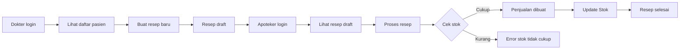

# 🧪 Mini Project – Rumah Sakit Anwar Medika

Repository ini adalah skeleton aplikasi **Laravel 12** untuk mini project **Peresepan Dokter & Penjualan Obat** di Rumah Sakit Anwar Medika.

Stack yang digunakan:

- **Laravel 12.x**
- **Laravel Breeze** (authentication scaffolding)
- **Vite 7** untuk bundling asset (JS/CSS)
- **Tailwind CSS 3** untuk styling

---

## 1. Deskripsi Project

Aplikasi ini mensimulasikan alur kerja sederhana antara **Dokter** dan **Apoteker**:

- **Dokter**
  - Login ke sistem
  - Melihat daftar pasien
  - Membuat resep obat untuk pasien
- **Apoteker**
  - Login ke sistem
  - Melihat resep yang dibuat dokter
  - Memproses resep menjadi transaksi penjualan
  - Mengurangi stok obat dan melihat riwayat penjualan

Fokus utama:

- Manajemen **master obat**
- Pembuatan **resep** oleh dokter
- **Penjualan** berdasarkan resep oleh apoteker
- Menjaga **konsistensi stok** dan status resep

---

## 2. Arsitektur & Struktur Utama

### 2.1. Teknologi Utama

- **Framework**  : Laravel (pattern MVC)
- **Frontend**   : Blade + Tailwind CSS (via Vite)
- **Database**   : MySQL / SQLite (bisa disesuaikan)
- **Autentikasi**: Laravel Auth (login berbasis email + password, via Breeze)
- **Authorization**: Middleware & Policy berbasis role (`dokter`, `apoteker`)

---

### 2.2. Struktur Folder / Lapisan Utama

- `app/Models`
  - `User` → punya atribut `role` (`dokter` / `apoteker`)
  - `Pasien`
  - `Obat`
  - `Resep`
  - `ResepDetail`
  - `Penjualan`
  - `PenjualanDetail`

- `app/Http/Controllers`
  - `Auth\...` → login & logout (Laravel Breeze)
  - `DashboardController` → ringkasan resep & penjualan
  - `ResepController` → fitur dokter (buat & lihat resep)
  - `PenjualanController` → fitur apoteker (proses resep jadi penjualan)
  - `ObatController` → CRUD master obat & stok
  - `PasienController` → fitur pasien
  - `ProfileController` → fitur profil (Laravel Breeze)

- `app/Http/Middleware`
  - `auth` → memastikan user sudah login
  - `verified` → memastikan akun/email telah terverifikasi (tidak digunakan)
  - `RoleMiddleware` → membatasi akses berdasarkan role:
    - `role:dokter`
    - `role:apoteker`

- `app/Policies` → membatasi akses berdasarkan fitur/method
  - `ObatPolicy`
  - `ResepPolicy`

- `app/Exceptions`
  - `StokTidakCukupException` → dilempar saat stok obat tidak mencukupi ketika proses penjualan

- `resources/views`
  - Blade layout utama (`layouts/app.blade.php`)
  - Halaman:
    - Halaman depan / welcome
    - Login & Register
    - Dashboard
    - Master obat (apoteker)
    - Resep: form & detail resep (dokter)
    - Resep dokter: daftar resep untuk diproses (apoteker)
    - Detail penjualan / riwayat penjualan
    - Daftar pasien

- `database/migrations`
  - Tabel: `users`, `pasiens`, `obats`, `reseps`, `resep_details`, `penjualans`, `penjualan_details`, dll.

- `database/seeders`
  - Seeder untuk:
    - User dokter & apoteker
    - Dummy pasien
    - Dummy obat

---

## 3. Alur Sederhana Aplikasi

### 3.1. Alur Role Dokter

1. Dokter **login** ke aplikasi.
2. Dokter membuka menu **Resep**:
   - Melihat daftar pasien atau resep.
   - Membuat resep baru:
     - Pilih pasien.
     - Tambah beberapa obat dari master obat.
     - Isi dosis & jumlah.
3. Sistem menyimpan data ke:
   - Tabel `reseps` (header resep).
   - Tabel `resep_details` (detail obat tiap baris).
4. Status resep awal: **draft / masih dapat di edit**.
5. Klik `Kirim ke Apotek` dan akan mengubah status dari **draft** ke **completed**

### 3.2. Alur Role Apoteker – Proses Resep jadi Penjualan

1. Apoteker **login** ke aplikasi.
2. Apoteker membuka menu **Resep Dokter**:
   - Melihat daftar resep yang dibuat dokter dan belum diproses dengan status **completed**.
3. Apoteker memilih satu resep → klik **Proses di Apotek**.
4. Fungsi `createPenjualanFromResep()` akan:
   - Load resep beserta `details.obat`.
   - Cek stok tiap obat:
     - Jika **stok kurang** → lempar `StokTidakCukupException`, tampil pesan error, proses dibatalkan.
     - Jika **stok cukup**:
       - Membuat record di tabel `penjualans` (header transaksi) dengan status penjualan **pending**.
       - Membuat record di tabel `penjualan_details` (copy dari `resep_details`).
       - Mengupdate status resep menjadi **processed**.
   - Semua proses dibungkus dalam **database transaction** agar data tetap konsisten.
5. Apoteker membuka menu **Penjualan**
   - Melihat daftar penjualan yang diproses di apotek dan transaksi masih status **pending**.
6. Apoteker memilih satu penjualan → klik **Bayar**.
7. Fungsi `finalize()` akan:
   - Load data penjualan
   - Cek kembali stok tiap obat:
     - Jika **stok kurang** → lempar `RuntimeException`, tampil pesan error, transaksi dibatalkan.
     - Jika **stok cukup**:
       - Mengurangi stok di tabel `obats`.
       - Mengupdate status penjualan menjadi **paid**.
8. Apoteker bisa melihat **riwayat penjualan** di menu Penjualan.

### 3.3. Diagram Alur



---

## 4. 📦 System Requirements

### 4.1. Server / Backend

- **PHP** `^8.2`
- **Composer** `^2.x`
- Ekstensi PHP umum untuk Laravel:
  - `bcmath`, `ctype`, `fileinfo`, `json`, `mbstring`,
  - `openssl`, `pdo`, `tokenizer`, `xml`

### 4.2. Frontend / Build Tools

- **Node.js** `>= 18` (LTS disarankan)
- **npm** `>= 9`

### 4.3. Database

- Contoh konfigurasi:
  - **SQLite** (paling simpel untuk testing), atau
  - **MySQL / PostgreSQL** (sesuai kebutuhan)

---

## 5. 🚀 Cara Setup & Instalasi

> Semua perintah dijalankan dari root folder project.

### 5.1. Clone Repository

```bash
git clone https://github.com/pilanggandu/rsam-mini-project.git
cd rsam-mini-project
```

### 5.2. Install Dependency PHP

```bash
composer install
```

### 5.3. Salin File Environment

Linux / macOS:

```bash
cp .env.example .env
```

Windows (Command Prompt / PowerShell):

```bash
copy .env.example .env
```

### 5.4. Generate Application Key

```bash
php artisan key:generate
```

### 5.5. Konfigurasi Database

Edit file `.env` sesuai kebutuhan.

**Contoh SQLite:**

```env
DB_CONNECTION=sqlite
DB_DATABASE=/full/path/ke/project/database/database.sqlite
```

Jangan lupa buat file database-nya jika belum ada:

```bash
touch database/database.sqlite
```

**Contoh MySQL:**

```env
DB_CONNECTION=mysql
DB_HOST=127.0.0.1
DB_PORT=3306
DB_DATABASE=nama_database
DB_USERNAME=nama_user
DB_PASSWORD=password
```

---

## 6. 🧬 Langkah Migration & Seeding

### 6.1. Menjalankan Migration

```bash
php artisan migrate
```

Jika ingin mengulang dari awal:

```bash
php artisan migrate:fresh
```

### 6.2. Menjalankan Seeding Dummy Data

Untuk mengisi data awal (user, pasien, obat, dll):

```bash
php artisan db:seed
```

Atau, sekaligus reset + seed:

```bash
php artisan migrate:fresh --seed
```

> Detail data yang di-seed bisa dicek di folder `database/seeders`.

---

## 7. 🧑‍💻 Menjalankan Aplikasi (Development)

### 7.1. Jalankan Laravel

```bash
php artisan serve
```

Secara default berjalan di:

- `http://127.0.0.1:8000`

### 7.2. Install Dependency Frontend

```bash
npm install
```

### 7.3. Jalankan Vite Dev Server

Di terminal lain:

```bash
npm run dev
```

Biasanya berjalan di:

- `http://127.0.0.1:5173`

Pastikan Blade sudah menggunakan directive:

```php
@vite(['resources/css/app.css', 'resources/js/app.js'])
```

---

## 8. 🏗️ Build untuk Production

Untuk build asset production:

```bash
npm run build
```

Contoh langkah umum deployment:

```bash
composer install --no-dev --optimize-autoloader
php artisan migrate --force
php artisan config:cache
php artisan route:cache
npm install
npm run build
```

---

## 9. 💬 Kontribusi

1. Fork repository ini.
2. Buat branch baru:  
   `git checkout -b feature/nama-fitur`
3. Commit perubahan:  
   `git commit -m "Tambah fitur X"`
4. Push ke branch:  
   `git push origin feature/nama-fitur`
5. Buat Pull Request di GitHub.

---

## 10. 📄 Lisensi

Project ini menggunakan lisensi **MIT** (default dari Laravel).  
Silakan bebas memodifikasi sesuai kebutuhan.
